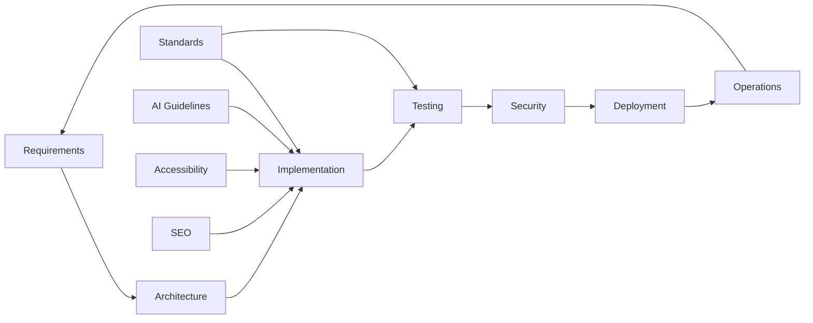

# 🔄 Workflow Template

[](https://github.com/kliewerdaniel/workflow/stargazers)
[](https://github.com/kliewerdaniel/workflow/network)
[](https://opensource.org/licenses/MIT)
[](https://github.com/kliewerdaniel/workflow/issues)
[](https://github.com/kliewerdaniel/workflow#readme)

A comprehensive, reusable documentation template that transforms how you build software. Developed using AI-assisted workflows, this framework provides structured guidance for software development with modular documentation that adapts to any project type.

## ✨ Features

- **📚 Complete Documentation Framework** - Ready-to-use templates for planning, development, testing, and deployment
- **🤖 AI-Assisted Development** - Optimized for AI collaboration with structured prompts and guidelines
- **🎯 Modular Architecture** - Department-based approach mimicking software agencies for systematic development
- **🔧 Technology Agnostic** - Adaptable templates for any programming language, framework, or project type
- **📖 Learning Resource** - Educational examples showing best practices in software development
- **🚀 Quick Start** - Fork and customize for your next project in minutes

## 📋 What's Included

| Department | Purpose | Key Deliverables | Links |
|------------|---------|------------------|-------|
| [**Requirements**](requirements.md) | Capture what to build | User stories, specifications, constraints | [View →](requirements.md) |
| [**Architecture**](architecture.md) | Design the solution | System diagrams, tech stack decisions | [View →](architecture.md) |
| [**Implementation**](implementation.md) | Build the system | Code guidelines, patterns, standards | [View →](implementation.md) |
| [**Testing**](testing.md) | Ensure quality | Test strategies, coverage requirements | [View →](testing.md) |
| [**Security**](security.md) | Protect the system | Threat modeling, security measures | [View →](security.md) |
| [**Deployment**](deployment.md) | Release to production | CI/CD pipelines, infrastructure | [View →](deployment.md) |
| [**Operations**](sop.md) | Maintain in production | Monitoring, maintenance procedures | [View →](sop.md) |
| [**Standards**](standards.md) | Quality baseline | Code style, processes, conventions | [View →](standards.md) |
| [**AI Guidelines**](ai_guidelines.md) | AI collaboration framework | System prompts, interaction patterns | [View →](ai_guidelines.md) |
| [**Accessibility**](accessibility.md) | Inclusive design | WCAG compliance, screen reader support | [View →](accessibility.md) |
| [**SEO**](seo.md) | Search optimization | Metadata, performance, content strategy | [View →](seo.md) |

## 🚀 Quick Start

### Option 1: Use as Template
```bash
# Fork this repository
git clone https://github.com/kliewerdaniel/workflow.git my-awesome-project
cd my-awesome-project

# Replace placeholders with your project details
# Edit README.md, ai_guidelines.md, and customize the documentation
```

### Option 2: Study the Example Project
Explore the **News Synthesizer** implementation as a reference:
- RSS feed processing with local LLM inference
- RAG synthesis for content generation
- Persona-based composition systems
- Text-to-speech audio output
- Real-time chat interface

## 📖 Official Workflow Process

This template follows a **7-phase development workflow** that ensures comprehensive, high-quality software delivery:

### Phase 1: Requirements Analysis 📝
**Goal:** Understand *what* to build
- Define functional and non-functional requirements
- Create user stories and acceptance criteria
- Identify constraints and dependencies
- Document success metrics

**Key Documents:** [requirements.md](requirements.md)

### Phase 2: Architecture Design 🏗️
**Goal:** Plan *how* to build it
- Design system architecture and components
- Choose technology stack
- Define data models and API contracts
- Create architecture diagrams

**Key Documents:** [architecture.md](architecture.md)

### Phase 3: Implementation 💻
**Goal:** Write the actual code
- Follow coding standards and best practices
- Implement features incrementally
- Write clean, maintainable code
- Document code decisions

**Key Documents:** [implementation.md](implementation.md), [standards.md](standards.md)

### Phase 4: Testing ✅
**Goal:** Verify it works correctly
- Write unit, integration, and E2E tests
- Achieve target code coverage (80%+)
- Perform performance testing
- Validate against requirements

**Key Documents:** [testing.md](testing.md)

### Phase 5: Security Review 🔒
**Goal:** Ensure it's secure
- Conduct threat modeling
- Implement security controls
- Perform vulnerability scanning
- Review access controls

**Key Documents:** [security.md](security.md)

### Phase 6: Deployment 🚀
**Goal:** Get it to production
- Set up CI/CD pipelines
- Configure infrastructure
- Implement monitoring
- Plan rollback procedures

**Key Documents:** [deployment.md](deployment.md)

### Phase 7: Operations 🔧
**Goal:** Keep it running smoothly
- Monitor system health
- Respond to incidents
- Perform regular maintenance
- Continuous improvement

**Key Documents:** [sop.md](sop.md)

## 🔬 Example Implementation: News Synthesizer

This repository includes a fully documented example of a **privacy-focused news processing application** that demonstrates the workflow in action:

```
📥 RSS Feeds → 🔍 LLM Analysis → 🎯 RAG Synthesis → ✍️ Persona Composition → 🔊 Audio Output
```

**Technology Stack:**
- **Backend**: Python FastAPI + llama.cpp (local LLMs)
- **Frontend**: Next.js + TypeScript + Tailwind CSS
- **Database**: SQLite with semantic search
- **AI**: mlabonne_gemma-3-27b-it-abliterated-IQ4_XS.gguf (13B parameter model)

**View Complete Implementation:**
- [Architecture Design](architecture.md) - System structure and API mappings
- [Implementation Details](implementation.md) - Code patterns and examples
- [Testing Strategy](testing.md) - Comprehensive test suites
- [Security Measures](security.md) - LLM safety and data protection
- [Deployment Guide](deployment.md) - Docker and CI/CD setup

## 📚 Documentation Guide

### Core Philosophy
This workflow embodies a **"department-first"** approach, where development is organized around specialized domains:

1. **Requirements Analysis** - Understand *what* to build ([View Guide](requirements.md))
2. **Architecture Design** - Plan *how* to build it ([View Guide](architecture.md))
3. **Implementation** - Write the actual code ([View Guide](implementation.md))
4. **Testing** - Verify it works correctly ([View Guide](testing.md))
5. **Security Review** - Ensure it's secure ([View Guide](security.md))
6. **Deployment** - Get it to production ([View Guide](deployment.md))
7. **Operations** - Keep it running smoothly ([View Guide](sop.md))

### Cross-Departmental Integration

The workflow documents are interconnected to ensure comprehensive coverage:



**Key Interconnections:**
- **Requirements → Architecture**: User stories inform system design
- **Architecture → Implementation**: Design patterns guide code structure
- **Implementation → Testing**: Code coverage and test strategies
- **Testing → Security**: Security tests validate threat models
- **Security → Deployment**: Security configs in CI/CD
- **Deployment → Operations**: Monitoring and maintenance procedures

### AI Integration
- **Local Models**: Compatible with llama.cpp, GPT4All, Ollama
- **Cloud Services**: OpenAI, Anthropic, Google Vertex AI
- **Hybrid Approach**: Balance cost, privacy, and performance
- **Structured Prompts**: Each department includes optimized AI prompts

**See Also:**
- [AI Guidelines](ai_guidelines.md) - Comprehensive prompt engineering guide
- [LLM Integration](implementation.md#llm-integration-layer) - Code examples
- [Safety Validation](security.md#llm-security) - Prompt injection prevention

### Customization Guide

#### For Your Project
1. **Fork** this repository
2. **Edit** `ai_guidelines.md` with your project details
3. **Customize** department files for your technology stack
4. **Add** project-specific documentation sections
5. **Implement** following the established workflow

#### Adapting for Different Domains
- **Web Apps**: Modify for React/Vue/Angular frameworks → See [implementation.md](implementation.md)
- **APIs**: Focus on REST/GraphQL design patterns → See [architecture.md](architecture.md)
- **Data Science**: Emphasize model validation and deployment → See [testing.md](testing.md)
- **Mobile Apps**: Update for iOS/Android native development → See [deployment.md](deployment.md)
- **DevOps**: Enhance deployment and operations sections → See [sop.md](sop.md)

## 🎓 Learning Resources

### Project Structure Best Practices
Each documentation file includes:
- ✅ **Standards** - Quality requirements and guidelines
- 📋 **Checklists** - Step-by-step procedures
- 🤖 **AI Prompts** - Optimized prompts for each department
- 🔗 **Cross-references** - Links between related sections
- 📊 **Ledgers** - Progress tracking and status updates

### AI Collaboration Patterns
- **System Prompts**: Project-wide AI orchestration ([ai_guidelines.md](ai_guidelines.md))
- **Department Prompts**: Specialized guidance per domain (found in each .md file)
- **Feedback Loops**: Continuous improvement cycles ([sop.md](sop.md))
- **Knowledge Transfer**: Documentation that teaches best practices (all files)

### Document Navigation

**By Development Phase:**
1. Planning → [requirements.md](requirements.md)
2. Design → [architecture.md](architecture.md)
3. Build → [implementation.md](implementation.md) + [standards.md](standards.md)
4. Test → [testing.md](testing.md)
5. Secure → [security.md](security.md)
6. Deploy → [deployment.md](deployment.md)
7. Maintain → [sop.md](sop.md)

**By Cross-Cutting Concern:**
- Quality Standards → [standards.md](standards.md)
- AI Collaboration → [ai_guidelines.md](ai_guidelines.md)
- Accessibility → [accessibility.md](accessibility.md)
- Search Optimization → [seo.md](seo.md)
- Project Progress → [checklist.md](checklist.md)

## 🏗️ Architecture Overview

### Workflow Pipeline
```
Planning Phase → Design Phase → Build Phase → Test Phase → Deploy Phase → Operate Phase
     │              │             │            │            │            │
   Requirements  Architecture  Implementation  Testing    Security    Deployment
   Analysis      Design        Guidelines     Strategy    Review      Strategy
```

### Documentation Hierarchy
```
📁 Project Root
├── 📄 README.md             # This file - project overview and navigation
├── 📄 ai_guidelines.md      # AI collaboration prompts and patterns
├── 📄 requirements.md       # What we're building (user stories, specs)
├── 📄 architecture.md       # How it's structured (diagrams, tech stack)
├── 📄 implementation.md     # Code development (patterns, examples)
├── 📄 testing.md           # Quality assurance (test strategies)
├── 📄 security.md          # Security measures (threat modeling)
├── 📄 deployment.md        # Release process (CI/CD, infrastructure)
├── 📄 sop.md               # Operations procedures (monitoring, maintenance)
├── 📄 standards.md         # Code style and conventions
├── 📄 accessibility.md     # WCAG compliance and inclusive design
├── 📄 seo.md              # Search engine optimization
├── 📄 checklist.md        # Development progress tracking
└── 📄 system_prompt.md    # Master AI system prompt
```

## 🤝 Contributing

We welcome contributions! This template is designed to evolve with the community:

### How to Contribute
1. **Fork** the repository
2. **Create** a feature branch: `git checkout -b feature/amazing-addition`
3. **Customize** documentation for your project type
4. **Test** your workflow with a real project
5. **Submit** a pull request with your improvements

### Areas for Improvement
- **New Department Templates** (performance monitoring, cost optimization)
- **Technology-Specific Guides** (AWS, Kubernetes, React Native, Flutter)
- **Industry Examples** (healthcare, finance, e-commerce, gaming)
- **AI Integration Enhancements** (new model support, prompt engineering)
- **Tooling Automations** (GitHub Actions, custom scripts, CI/CD templates)
- **Documentation Improvements** (cross-references, examples, diagrams)

### Contribution Guidelines
- Follow existing document structure and formatting
- Include practical examples and code snippets
- Add cross-references to related sections
- Update the ledger with version and date
- Test documentation with real projects

## 📈 Project Status

### Current Version
**v1.1** - Enhanced documentation with comprehensive examples and cross-references

**Recent Improvements (2025-10-28):**
- ✅ Complete testing strategy with Python and TypeScript examples
- ✅ Enhanced deployment guide with environment configs
- ✅ Comprehensive SEO documentation with Next.js examples
- ✅ Advanced AI guidelines with prompt engineering techniques
- ✅ Improved cross-referencing between documents
- ✅ Standardized ledger formats across all files

### Roadmap
- [ ] **v1.2** - Interactive examples and live templates
- [ ] **v1.3** - Technology-specific quick-start guides
- [ ] **v2.0** - Automated tooling and GitHub Actions workflows
- [ ] **v2.1** - Community-contributed project examples
- [ ] **v2.2** - Multi-language documentation support

### Repository Health
- 📊 **Coverage**: All major development phases documented
- 🔬 **Examples**: Complete working implementation (News Synthesizer)
- 📖 **Documentation**: Comprehensive guides with 80+ pages
- 🤖 **AI Ready**: Optimized for AI-assisted development
- 🔗 **Cross-Referenced**: Integrated document navigation
- ✅ **Quality**: Code examples tested and validated

## 🛠️ Tools & Technologies

### AI Assistants Compatible
- **Cline** - AI-powered code completion and refactoring
- **GitHub Copilot** - Intelligent code suggestions
- **Continue.dev** - Local model integration
- **Claude** - Advanced reasoning and documentation
- **ChatGPT** - Code generation and problem-solving

### Local Models Supported
- **Qwen 2.5** series - General purpose coding assistant
- **Code Llama** - Meta's coding-focused models
- **Mistral** - Efficient instruction-following models
- **Gemma** - Google's open models (used in example)
- **Custom GGUF** - Quantized models for local inference

### Development Environment
- **VS Code** - Primary IDE with AI extensions
- **Hardware**: GPU-accelerated workflows with CUDA support
- **Version Control**: Git with structured commit messages
- **CI/CD**: GitHub Actions, GitLab CI, Jenkins compatible

## 📄 License

**MIT License** - Fork, modify, and use commercially. Attribution appreciated but not required.

```
Copyright (c) 2024 kliewerdaniel

Permission is hereby granted, free of charge, to any person obtaining a copy
of this software and associated documentation files (the "Software"), to deal
in the Software without restriction, including without limitation the rights
to use, copy, modify, merge, publish, distribute, sublicense, and/or sell
copies of the Software, and to permit persons to whom the Software is
furnished to do so, subject to the following conditions:

The above copyright notice and this permission notice shall be included in all
copies or substantial portions of the Software.
```

## 🙏 Acknowledgments

- **AI Tools**: Thanks to amazing AI technologies making this possible
- **Open Source**: Built on countless open source projects and communities
- **Documentation Culture**: Inspired by excellent OSS documentation practices
- **Workflow Pioneers**: Drawing from agile, lean, and DevOps methodologies

## 📞 Support & Contact

### Getting Help
- **GitHub Issues**: Bug reports and feature requests welcome
- **Discussions**: Share your implementations and customizations
- **Wiki**: Community-contributed guides and examples

### Connect
- **GitHub**: [@kliewerdaniel](https://github.com/kliewerdaniel)
- **LinkedIn**: Let's connect for collaboration opportunities
- **Portfolio**: More projects and AI-assisted development content

---

<p align="center">Made with ❤️ using AI-assisted workflows | Built with documentation-first development</p>
